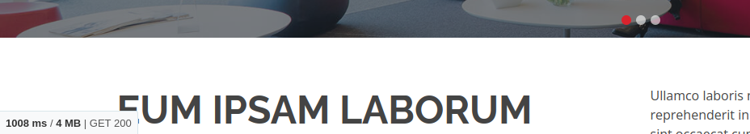
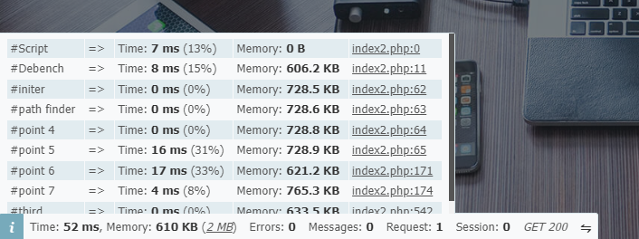

# Debench
<code style="color : #FFD700">Note: There is not much in this project yet, be patient.</code>

A small debug/benchmark helper for PHP




# How to use

Use composer:
```shell
composer require myaaghubi/debench
```
Then have it like:
```php
require __DIR__ . '/vendor/autoload.php';

// call it from your index.php after autoload 
// then check the webpage with your browser
$debench = new DEBENCH\Debench();

sleep(1);
$st = str_repeat("Debench!", 1000);

// after a seconds
$debench->newPoint("step one");

sleep(2);
$st .= str_repeat("Debench!", 1000);

// after two more seconds
$debench->newPoint("step two");
```
For production mode just put a flag:
```php
$debench = new DEBENCH\Debench(false);
// or
$debench->setEnable(false);
```

## License

You are allowed to use this plugin under the terms of the MIT License.

Copyright (C) 2024 Mohammad Yaaghubi
