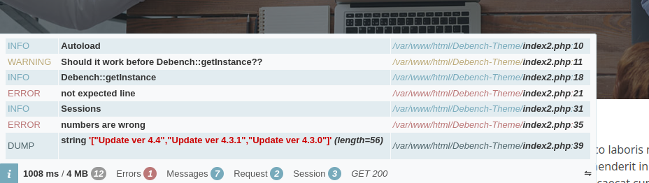

# Debench

[](https://github.com/myaaghubi/Debench/actions/workflows/ci.yml) [](https://coveralls.io/github/myaaghubi/Debench?branch=main)  

A small and lightweight debug/benchmark helper for PHP.

## 



# How to use

Use composer:

```shell
composer require myaaghubi/debench
```

Then have it like:

```php
namespace DEBENCH;

require __DIR__ . '/vendor/autoload.php';

// call it from your index.php after autoload
// then check the webpage with your browser
// $debench = new Debench(true, 'path/to/public/theme/assets');
Debench::getInstance(true, 'assets');

// for enable() or minimalOnly() you can
// call them even before getInstance
Debench::enable(false);

// for dump(), info(), warning() and error() you can
// call them before getInstance too
Debench::info('let\'s use some memory');

// let's use some memory
$st = str_repeat("Debench!", 10000);

Debench::point('one');

// let's use more memory
$st .= str_repeat("Debench!", 10000);

// $debench->newPoint("two");
Debench::point('two');
```

For `minimal` mode:

```php
// it is safe and secure to use
// $debench->setMinimalOnly(true);
Debench::minimalOnly(true);
```

For `production` mode

```php
// it's better to do it on initializing
//$debench = new Debench(false);
Debench::getInstance(false);
// or
Debench::enable(false);
```

## License

You are allowed to use this plugin under the terms of the MIT License.

Copyright (C) 2024 Mohammad Yaaghubi
